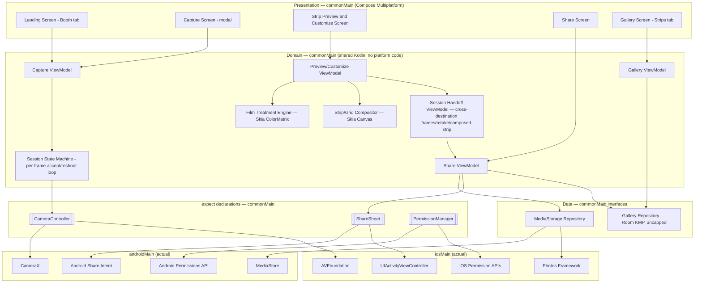
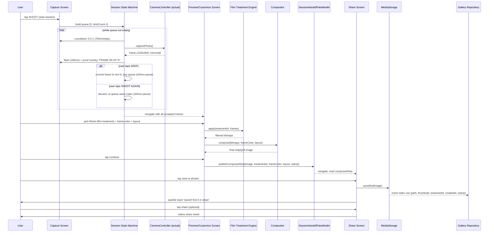
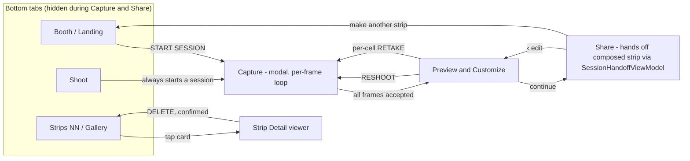

# Architecture

Photobooth is a Kotlin Multiplatform + Compose Multiplatform app targeting Android and iOS. This document describes the shared architecture, the reasoning behind each major library choice, and the core data flow. It is the technical reference; see `README.md` for the project pitch and `CLAUDE.md` for how to work in this repo.

## Guiding principle

Everything that isn't inherently platform-specific lives in shared Kotlin (`commonMain`). Filter rendering and photo-strip compositing — the two hardest pieces of a photobooth app — are Skia-based (via Skiko, which already backs Compose Multiplatform) and therefore fully shared: Android and iOS produce matching output by construction, not by parallel implementation and manual parity testing. Only camera control, save-to-gallery, share sheets, and permission prompts are platform-specific, isolated behind three small `expect/actual` interfaces.

## Design source

Visual design comes from a high-fidelity handoff at [`design/handoff/README.md`](./design/handoff/README.md) — **Boothie**, a Y2K/scrapbook aesthetic (cream ground, hot-pink primary, purple/gold/mint accents, rounded pill shapes, tape-corner and sparkle motifs, Fredoka/Nunito/Caveat type), which replaced the original "Industry" blueprint aesthetic (square corners, hairline borders, "+" registration marks, Barlow/Barlow Condensed type, one steel-blue accent) in a full rebrand. Colors, type, spacing, hit targets, and copy in that document are **final** — recreate pixel-faithfully. `design/handoff/*.dc.html` are HTML prototypes for visual reference only, not code to port; `android-frame.jsx`/`support.js` are prototype chrome, not app logic. Everything below reflects that handoff.

## Layered overview



## End-to-end data flow (one capture session)

Capture is a **per-frame countdown → capture → proof/accept-or-reshoot loop**, not a plain burst — each exposure is reviewed individually before the next one fires. A reshoot always re-targets the same slot index, so the strip can never end up with a gap. The same single-index queue mechanism powers the per-cell `RETAKE 0N` action from the Preview screen.



## Screen navigation

Root nav is **tab-based**, not a linear wizard: bottom tabs **Booth / Shoot / Strips** (hidden during Capture and Share, both modal-like full-screen flows). The old separate Review and Export screens collapse into one **Preview & Customize** screen that handles flicket (film treatment)/frame-color/layout selection; its "continue" action now hands off the already-composed strip to a separate **Share** screen rather than saving directly — see `PhotoboothNavHost.kt`'s own doc-comment ASCII diagram, which is the ground truth this section transcribes.

Since Navigation-Compose route args are strings/primitives only and can't carry an `ImageBitmap`, Customize's "continue" publishes the composed strip through `SessionHandoffViewModel.composedStrip` (a `ComposedStrip` data class: image + treatment code + frame color + layout + stamp) rather than passing it as a nav argument; Share reads that slot once on entry. Share's own "save to photos" / "share" / "make another strip" actions are where the actual `MediaRepo`/`GalleryRepo`/`ShareSheet` writes now happen — moved out of the old Preview/Customize `StripPreviewViewModel.onSavePng()` into a new `ShareViewModel`, so Customize/Preview no longer owns any save/share responsibility at all.



Landing ships **variant 1a "Spec sheet"** only (light ground, drawn strip figure, kicker + condensed H1 + body, single `START SESSION` button) — the design doc's two alternative treatments (1b Steel field, 1c Procedure list) are reference-only, not built.

## Project / module structure

```
Photobooth/
  composeApp/
    src/
      commonMain/   → screens, ViewModels, SessionStateMachine, FilmTreatmentEngine,
                       Compositor, data models, repository interfaces, expect decls
      androidMain/   → CameraX-based CameraController, MediaStore save, Android share
                       intent, Android permission requests
      iosMain/       → AVFoundation-based CameraController, Photos-framework save,
                       UIActivityViewController share, iOS permission requests
  iosApp/             → thin Xcode/SwiftUI wrapper hosting the compiled Compose UI
```

## Library choices and rationale

| Concern | Chosen | Why this one | Alternatives considered, and why not |
|---|---|---|---|
| UI framework | **Compose Multiplatform** | Shared UI code across Android/iOS; reuses existing Compose/Android experience directly, no Swift/SwiftUI learning curve. Skia (Skiko) underneath also gives shared image/canvas primitives. | Flutter (new language/ecosystem, no Kotlin reuse); React Native (JS, and image/canvas work would need per-platform native bridges — loses the "write filters once" advantage). |
| Async/state | **Kotlin Coroutines + Flow** | Native to Kotlin, works identically on every KMP target. | RxKotlin/RxJava (older pattern, extra dependency, no multiplatform advantage over Flow). |
| Navigation | **Navigation-Compose (multiplatform)** | Official Google/JetBrains-backed, same API as Android-only, ships a common artifact for KMP. | Voyager, Decompose (solid, but extra third-party dependency/API surface when the official option now covers the need). |
| DI | **Koin** | Purpose-built for multiplatform, no annotation-processor/codegen step, lightweight for a solo-dev app. | Hilt (Android-only, doesn't run on iOS at all); Dagger/Anvil (heavier, codegen complexity not justified at this scale). |
| Local DB (gallery index) | **Room (Kotlin Multiplatform)** | Google-official, now supports iOS targets; near-zero ramp-up given existing Room/Android experience. | SQLDelight (more mature multiplatform track record, compile-time-checked raw SQL, but a new API to learn — worth revisiting if Room KMP's iOS driver proves rough). |
| Image/canvas processing | **Skia via Skiko** (bundled with Compose Multiplatform) | Already present because of CMP; gives shared `ColorMatrix` filters and shared `Canvas` drawing for strip compositing — the core reason CMP was chosen over Flutter/RN. | Per-platform native filter code (Core Image on iOS, RenderEffect on Android) — works, but throws away the "write once" benefit. |
| Camera (Android) | **CameraX** | Modern, lifecycle-aware wrapper over Camera2; absorbs device-fragmentation quirks (aspect ratios, orientation). | Camera2 directly (far more boilerplate and device-specific edge cases for a solo dev to own). |
| Camera (iOS) | **AVFoundation** (via Kotlin/Native interop or a thin Swift shim) | The standard, only real option for camera capture on iOS. | — |
| Permissions | **expect/actual wrapper**, optionally backed by **moko-permissions** | Avoids hand-rolling permission-request boilerplate twice. | Accompanist Permissions (Android-only, no iOS story). |
| Crash reporting | **Firebase Crashlytics** (opt-in) | Widely used, free tier, easy to disclose truthfully in store privacy forms. | Sentry (comparable; Crashlytics chosen for ecosystem familiarity). |
| Fonts | **Fredoka + Nunito + Caveat** (Google Fonts, OFL-licensed), each bundled as static-weight `.ttf` instances of their variable font in `composeApp/src/commonMain/composeResources/font/` and wired through Compose Multiplatform's `Font`/`FontFamily` resource APIs (`theme/Type.kt`) — replacing the original Barlow/Barlow Condensed pairing as part of the Boothie rebrand. Fredoka (500/600/700) carries display/headline/button text, Nunito (400/600/700/800) carries body/UI copy, Caveat (600/700) carries handwritten stamps/captions. | Design-mandated per the (now Boothie) design handoff; real assets, not a placeholder/pending item. | A codebase-default font pairing — not applicable here since this app's visual identity *is* this type system. |
| Icons | **Lucide**, stroke-width 1.5 | Design-mandated replacement for the prototype's monospace glyph stand-ins (camera / aperture / layout-grid tab icons). | — |

## Core domain model

No sticker/overlay editor — the design has no drag-and-place system. "Frame" means a background color choice, not an overlay.

```
CaptureSession
  id, createdAt, shotCount (2-8, default 4), rawFramePaths: List<String?>  (sparse until accepted)

FilmTreatment ("flicket" presets, not user-created — see `filter/FilmTreatment.kt` for the exact ColorMatrixOps chains).
The first 5 are design-mandated (dc.html's `FILMS` table); F05 Black & White is a maintainer
addition on top of that fixed set, added the same way any future preset would be — one more
enum entry, since the Customize screen's flicket row iterates `FilmTreatment.entries` directly.
  F00 None          — identity ColorMatrix (skipped entirely at composite time as a no-op paint, see StripCompositor)
  F01 Disposable    — saturate(1.5).then(contrast(1.15)).then(brightness(1.05))
  F02 Sunkissed     — sepia(0.45).then(saturate(1.3)).then(brightness(1.08)).then(hueRotateDegrees(-6))
  F03 Cyber         — saturate(1.6).then(hueRotateDegrees(175)).then(contrast(1.1))
  F04 Dreamy        — brightness(1.15).then(saturate(0.75)).then(contrast(0.92))
  F05 Black & White — grayscale(1).then(contrast(1.12))
  — each a Skia ColorMatrix composition. The enum also carries an optional duotoneOverlay/
    duotoneOverlayAlpha pair (a Multiply-blend overlay) inherited from the retired Industry-era
    F04 "Steel duotone" preset; none of the six current presets set it, so StripCompositor's
    duotone-overlay branch is dead code today, kept only in case a future preset needs it.

FrameColor (4 fixed presets, see `filter/FrameColorPreset.kt`):
  Butter #FFC53D (text #2B1830) / Bubblegum #FF6FBB (text #FFF7EA, default) /
  Grape #8A3FFC (text #FFF7EA) / Spearmint #7FEBD1 (text #2B1830)
  — background + derived text/rule colors, see design handoff's Design Tokens section

Layout: Strip (vertical, 1 column) | Grid (2x2) — both in v1

CompositeResult
  id, sourceSessionId, filmTreatmentId, frameColorId, layout, finalImagePath, thumbnailPath, createdAt

HistoryEntry  (Room table, uncapped — unlike the prototype's 12-item localStorage cap)
  id, finalImagePath, thumbnailPath, filmTreatmentId, createdAt, stamp (date label)
```

The app name is **not** modeled as domain/settings data: `theme/Brand.kt` is a plain `object Brand { const val NAME = "Boothie" }` constant, deliberately replacing the two former placeholder strings ("Photobooth" in `StripPreviewUiState.brand`, "FOURFRAME" in `LandingScreen.kt`) instead of the previously-floated `AppSettings`/`SettingsRepo` idea — there's no user-facing rename feature, so a settings-repository layer for a single hardcoded string was never built and isn't planned.

Kept deliberately small for v1 — no user/account entities, no sync metadata (`updatedAt`, `syncState`, etc.) since there's no backend to reconcile with. If cloud sync becomes a v2 goal, this table grows a `remoteId`/`syncStatus` column rather than requiring a redesign.

## Strip composition — exact formulas

Capture at **1200×900 (4:3)**, mirrored horizontally end-to-end (preview, proof, and final output — "what the user saw is what they get"). Canvas composed at **2× design scale** for print:
- Design units: content width 320, padding 16, gap 10, footer 30 (all ×2 on actual output).
- Strip layout (1 column): each photo 320×240. Grid layout (2 columns): each photo 155×155.
- Output height = 2·padding + rows·photoHeight + (rows−1)·gap + footer.
- Draw order: fill frame-color background → draw each photo clipped (center-crop to the cell's aspect ratio) with the film treatment's `ColorMatrix` applied → footer: 1px rule at 35% opacity, brand text left, date stamp right. `StripCompositor` also supports an optional per-treatment Multiply-blend duotone overlay (a holdover from the retired Industry-era "Steel duotone" preset), but none of the current 5 Boothie flicket presets (None/Disposable/Sunkissed/Cyber/Dreamy) set one, so that branch doesn't fire today. **Not mirrored again here** — `CameraController.capturePhoto()` already returns mirrored bytes (Phase 1), so mirroring a second time at compositing would flip the image back to unmirrored. Mirror exactly once, at capture.
- Frames held as JPEG ~0.92 quality between capture and export; final export is PNG.
- Lands a vertical strip near 2×6 in at 300 dpi — intentionally matches a physical photobooth strip.

**Implementation status (Phase 2):** `StripCompositor` implements background, photos-with-treatment, and the (currently-unused) duotone-overlay branch in full. The footer **rule** (the 1px line) is implemented; the footer **text** (brand left, date stamp right) is not yet — it needs a `FontFamily.Resolver` to construct a `Paragraph` outside a `@Composable` context, its own small piece of platform plumbing, deferred to a follow-up rather than bundled into Phase 2. Don't assume composed output has footer text until that lands.

## Design system

A dedicated Compose theme/token module is required before Phase 1 screens are built — the aesthetic is specific and consistent across every screen. Following the Boothie rebrand, this module (`theme/Color.kt`, `Type.kt`, `Theme.kt`, `Brand.kt`) is fully implemented, not just planned:
- **Color tokens** (`theme/Color.kt`'s `PhotoboothColors`): Cream `#FFF7EA` (background), Ink `#2B1830` (text), Hot pink `#FF4FA0` (primary action, pressed `#C22A79`), Purple `#8A3FFC`, Gold `#FFC53D`, Mint `#5FE3C4` (accents), plus a dark capture/share gradient background (`#3d1f5c → #1B0A2E`) and the accent-tint/hairline sets in the design handoff's Design Tokens section — ported into a Compose object, with continuity aliases (`Ground`, `Accent`, etc.) kept pointed at their nearest Boothie equivalent so not-yet-rewritten call sites keep compiling. This replaces the original Industry-era palette (ground `#f2f2f3`, paper `#f5f5f8`, text `#1d1f20`, steel-blue accent `#5980a6`).
- **Shape**: a rounded scale (`theme/Theme.kt`'s `BoothieShapes`) — `extraSmall` 8dp (thumbnail cells), `small` 12dp (gallery cards, swatch chips), `medium` 16dp (Customize mount), `large` 18dp (Share mount), `extraLarge` 20dp (Capture viewfinder card) — plus pill shapes (`RoundedCornerShape(50)`) used directly at the call site for buttons/chips/tab-bar segments. This replaces the original Industry-era radius-0-everywhere square-corner scale.
- **Motifs**: two reusable Composables, each with one documented usage rule (design handoff's Motifs section):
  - `TapeCorner` (`ui/TapeCorner.kt`) — two low-opacity rotated "tape" rectangles at opposing corners (28×13dp, top-left at -25°, bottom-right at 20°, ~25% opacity ink by default). Used **only** on photo/strip mount objects (Booth's strip-preview figure, the Customize mount, the Share mount, gallery cards) — this replaces the retired `CornerTicks` registration-mark motif from the Industry aesthetic.
  - `Sparkle` (`ui/Sparkle.kt`) — a four-pointed sparkle glyph, drawn as a `Path` on a `Canvas`. Used **only** for celebration/confirmation moments (the Share screen's "strip's ready!" headline, the `Toast` composable shown on save/share).
- **Fonts**: Fredoka (display/headline/button), Nunito (body/UI copy), Caveat (handwritten stamps/captions) — see the Library choices table and `theme/Type.kt`; real bundled `.ttf` resources, not a placeholder.
- **Spacing**: literal 0.85×-density scale (3.4/5/6.8/8/10.2/13.6/17/20.4/24/27.2/34/44/54.4px), not a standard 4/8px grid — port as-is; unchanged by the rebrand.

## Non-functional considerations

- **iOS builds require a Mac** — not yet available. Android leads development; revisit iOS bring-up once Mac/cloud-CI access (e.g. Codemagic, which supports KMP/CMP iOS signing without local Mac hardware) is sorted.
- **Min OS versions**: Android `minSdk = 29` — the constraint is the export path, not the camera: MediaStore scoped storage only exists from API 29, and on API 26-28 the same `insert()` needs the `WRITE_EXTERNAL_STORAGE` *runtime* permission (a manifest declaration alone throws `SecurityException`). CameraX itself supports 21+. iOS 15+ as the practical floor for current Compose Multiplatform support.
- **Permissions/privacy strings**: `NSCameraUsageDescription`, `NSPhotoLibraryAddUsageDescription` (iOS); `CAMERA` + scoped MediaStore writes (Android, no broad storage permission needed on API 29+).
- **Shutter sound legality**: Japan/South Korea require a non-disableable shutter sound — build this in from day one.
- **Storage growth**: fully-local, uncapped history — the Gallery screen needs delete from v1 (no automatic eviction, unlike the prototype's 12-item cap).
- **Performance**: capture-loop and Skia filter/composite work must run off the main thread (`Dispatchers.Default`/IO); generate downsampled thumbnails for the Gallery grid instead of loading full-res images.
- **App name**: decided — **Boothie**. Hardcoded as `theme/Brand.kt`'s `object Brand { const val NAME = "Boothie" }` rather than a config-driven settings value, since there's no user-facing rename feature (see § Core domain model).

## Build notes (Phase 0 scaffolding decisions)

- **AGP 9 vs. the KMP plugin**: AGP 9.0+ deprecated applying `com.android.application` directly alongside `org.jetbrains.kotlin.multiplatform` in the same module (its long-term direction is a separate Android-application subproject depending on a KMP library subproject). Since the Kotlin Multiplatform and Compose Multiplatform Gradle plugins don't yet target that new structure, root `gradle.properties` sets `android.builtInKotlin=false` and `android.newDsl=false` — AGP's own documented escape hatch back to the pre-9.0 behavior those plugins expect. This has to live at the root, not scoped to `composeApp/` — AGP reads it before per-subproject properties take effect for this check (confirmed by trying the scoped version, which fails); a future non-KMP module would inherit the opt-out too, an accepted tradeoff. This currently only shows as a build warning, not an error — **but it is not indefinite**: AGP removes this opt-out entirely in AGP 10.0, targeted mid-2026 (i.e. imminently) per [Android's DSL/API migration timeline](https://developer.android.com/build/releases/gradle-plugin-roadmap). Before bumping AGP past 9.x, confirm the KMP/Compose Multiplatform plugins support the new DSL natively — don't just bump the version and discover the build breaks.
- **No `iosX64` target**: Compose Multiplatform 1.11.1 doesn't publish artifacts for the Intel iOS simulator target. `composeApp` only declares `iosArm64` (device) and `iosSimulatorArm64` (Apple Silicon simulator) — together these cover every realistic dev setup.
- **iosMain is unverified**: it compiles as Kotlin source but has never been built, since Kotlin/Native can only compile Apple targets on macOS (see the Mac blocker above). Treat it as unverified until Phase 4.

## v2 parking lot (explicitly deferred)

Live face-tracking AR filters (ARKit/ARCore or a paid SDK like Banuba/DeepAR), cloud sync & accounts, multi-user shared event galleries, printing (AirPrint/Android PrintManager), boomerang/short video capture, monetization (ads/IAP/subscription).