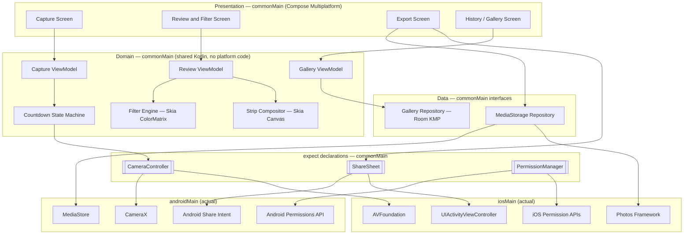
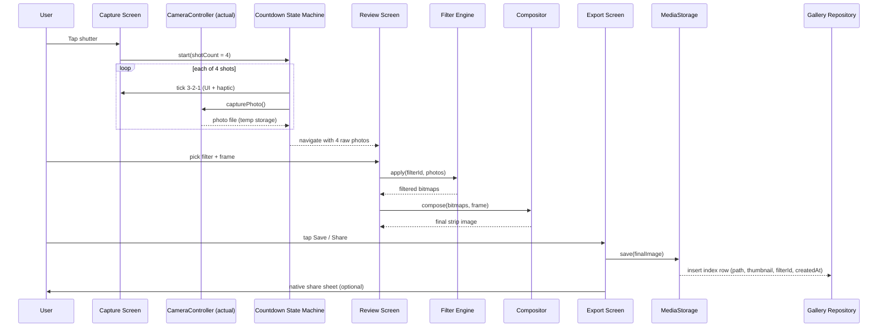
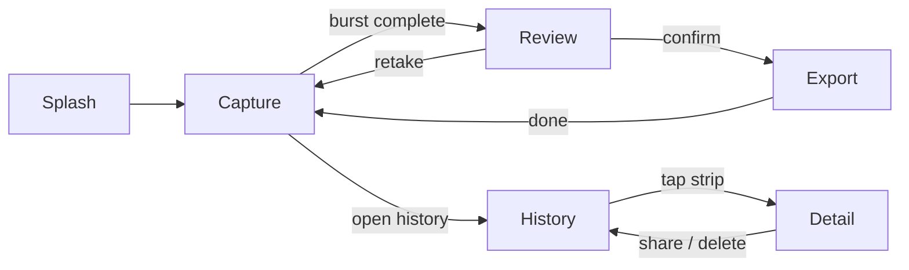

# Architecture

Photobooth is a Kotlin Multiplatform + Compose Multiplatform app targeting Android and iOS. This document describes the shared architecture, the reasoning behind each major library choice, and the core data flow. It is the technical reference; see `README.md` for the project pitch and `CLAUDE.md` for how to work in this repo.

## Guiding principle

Everything that isn't inherently platform-specific lives in shared Kotlin (`commonMain`). Filter rendering and photo-strip compositing — the two hardest pieces of a photobooth app — are Skia-based (via Skiko, which already backs Compose Multiplatform) and therefore fully shared: Android and iOS produce matching output by construction, not by parallel implementation and manual parity testing. Only camera control, save-to-gallery, share sheets, and permission prompts are platform-specific, isolated behind three small `expect/actual` interfaces.

## Layered overview



## End-to-end data flow (one capture session)



## Screen navigation



## Project / module structure

```
Photobooth/
  composeApp/
    src/
      commonMain/   → screens, ViewModels, CountdownStateMachine, FilterEngine,
                       StripCompositor, data models, repository interfaces, expect decls
      androidMain/   → CameraX-based CameraController, MediaStore save, Android share
                       intent, Android permission requests
      iosMain/       → AVFoundation-based CameraController, Photos-framework save,
                       UIActivityViewController share, iOS permission requests
  iosApp/             → thin Xcode/SwiftUI wrapper hosting the compiled Compose UI
```

## Library choices and rationale

| Concern | Chosen | Why this one | Alternatives considered, and why not |
|---|---|---|---|
| UI framework | **Compose Multiplatform** | Shared UI code across Android/iOS; reuses existing Compose/Android experience directly, no Swift/SwiftUI learning curve. Skia (Skiko) underneath also gives shared image/canvas primitives. | Flutter (new language/ecosystem, no Kotlin reuse); React Native (JS, and image/canvas work would need per-platform native bridges — loses the "write filters once" advantage). |
| Async/state | **Kotlin Coroutines + Flow** | Native to Kotlin, works identically on every KMP target. | RxKotlin/RxJava (older pattern, extra dependency, no multiplatform advantage over Flow). |
| Navigation | **Navigation-Compose (multiplatform)** | Official Google/JetBrains-backed, same API as Android-only, ships a common artifact for KMP. | Voyager, Decompose (solid, but extra third-party dependency/API surface when the official option now covers the need). |
| DI | **Koin** | Purpose-built for multiplatform, no annotation-processor/codegen step, lightweight for a solo-dev app. | Hilt (Android-only, doesn't run on iOS at all); Dagger/Anvil (heavier, codegen complexity not justified at this scale). |
| Local DB (gallery index) | **Room (Kotlin Multiplatform)** | Google-official, now supports iOS targets; near-zero ramp-up given existing Room/Android experience. | SQLDelight (more mature multiplatform track record, compile-time-checked raw SQL, but a new API to learn — worth revisiting if Room KMP's iOS driver proves rough). |
| Image/canvas processing | **Skia via Skiko** (bundled with Compose Multiplatform) | Already present because of CMP; gives shared `ColorMatrix` filters and shared `Canvas` drawing for strip compositing — the core reason CMP was chosen over Flutter/RN. | Per-platform native filter code (Core Image on iOS, RenderEffect on Android) — works, but throws away the "write once" benefit. |
| Camera (Android) | **CameraX** | Modern, lifecycle-aware wrapper over Camera2; absorbs device-fragmentation quirks (aspect ratios, orientation). | Camera2 directly (far more boilerplate and device-specific edge cases for a solo dev to own). |
| Camera (iOS) | **AVFoundation** (via Kotlin/Native interop or a thin Swift shim) | The standard, only real option for camera capture on iOS. | — |
| Permissions | **expect/actual wrapper**, optionally backed by **moko-permissions** | Avoids hand-rolling permission-request boilerplate twice. | Accompanist Permissions (Android-only, no iOS story). |
| Crash reporting | **Firebase Crashlytics** (opt-in) | Widely used, free tier, easy to disclose truthfully in store privacy forms. | Sentry (comparable; Crashlytics chosen for ecosystem familiarity). |

## Core domain model

```
CaptureSession
  id, createdAt, rawPhotoPaths: List<String>

Filter
  id, name, thumbnailPath, colorMatrix: FloatArray

Frame / Overlay
  id, name, previewPath, layoutType (STRIP | GRID)

CompositeResult
  id, sourceSessionId, filterId, frameId, finalImagePath, thumbnailPath, createdAt

HistoryEntry  (Room table)
  id, finalImagePath, thumbnailPath, filterId, createdAt
```

Kept deliberately small for v1 — no user/account entities, no sync metadata (`updatedAt`, `syncState`, etc.) since there's no backend to reconcile with. If cloud sync becomes a v2 goal, this table grows a `remoteId`/`syncStatus` column rather than requiring a redesign.

## Non-functional considerations

- **iOS builds require a Mac** — not yet available. Android leads development; revisit iOS bring-up once Mac/cloud-CI access (e.g. Codemagic, which supports KMP/CMP iOS signing without local Mac hardware) is sorted.
- **Min OS versions**: Android `minSdk = 26` (for CameraX compatibility, without excluding older devices unnecessarily); iOS 15+ as the practical floor for current Compose Multiplatform support.
- **Permissions/privacy strings**: `NSCameraUsageDescription`, `NSPhotoLibraryAddUsageDescription` (iOS); `CAMERA` + scoped MediaStore writes (Android, no broad storage permission needed on API 26+).
- **Shutter sound legality**: Japan/South Korea require a non-disableable shutter sound — build this in from day one.
- **Storage growth**: fully-local means unbounded on-device growth — the History screen needs delete from v1.
- **Performance**: burst capture and Skia filter/composite work must run off the main thread (`Dispatchers.Default`/IO); generate downsampled thumbnails for the History grid instead of loading full-res images.

## v2 parking lot (explicitly deferred)

Live face-tracking AR filters (ARKit/ARCore or a paid SDK like Banuba/DeepAR), cloud sync & accounts, multi-user shared event galleries, printing (AirPrint/Android PrintManager), boomerang/short video capture, monetization (ads/IAP/subscription), grid/collage layout variants beyond the classic strip.