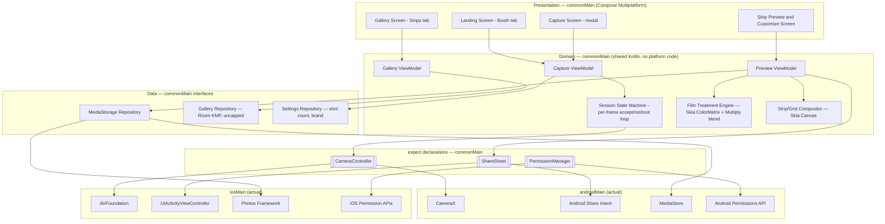
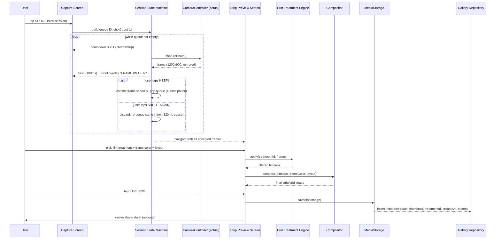
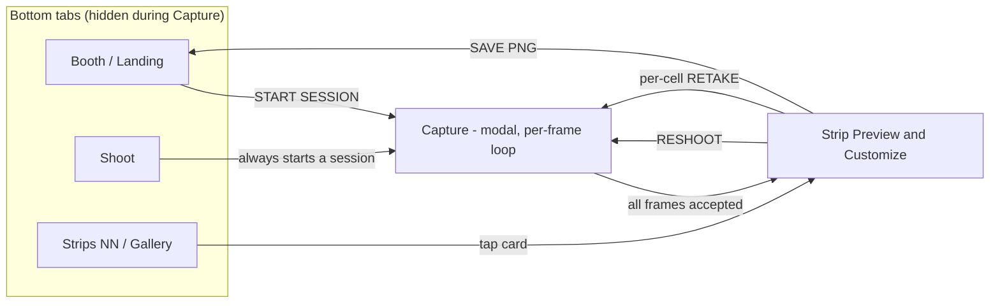

# Architecture

Photobooth is a Kotlin Multiplatform + Compose Multiplatform app targeting Android and iOS. This document describes the shared architecture, the reasoning behind each major library choice, and the core data flow. It is the technical reference; see `README.md` for the project pitch and `CLAUDE.md` for how to work in this repo.

## Guiding principle

Everything that isn't inherently platform-specific lives in shared Kotlin (`commonMain`). Filter rendering and photo-strip compositing — the two hardest pieces of a photobooth app — are Skia-based (via Skiko, which already backs Compose Multiplatform) and therefore fully shared: Android and iOS produce matching output by construction, not by parallel implementation and manual parity testing. Only camera control, save-to-gallery, share sheets, and permission prompts are platform-specific, isolated behind three small `expect/actual` interfaces.

## Design source

Visual design comes from a high-fidelity handoff at [`design/handoff/README.md`](./design/handoff/README.md) (the "Industry" blueprint aesthetic — square corners, hairline borders, "+" registration marks, Barlow/Barlow Condensed type, one steel-blue accent). Colors, type, spacing, hit targets, and copy in that document are **final** — recreate pixel-faithfully. `design/handoff/*.dc.html` are HTML prototypes for visual reference only, not code to port; `android-frame.jsx`/`support.js` are prototype chrome, not app logic. Everything below reflects that handoff.

## Layered overview



## End-to-end data flow (one capture session)

Capture is a **per-frame countdown → capture → proof/accept-or-reshoot loop**, not a plain burst — each exposure is reviewed individually before the next one fires. A reshoot always re-targets the same slot index, so the strip can never end up with a gap. The same single-index queue mechanism powers the per-cell `RETAKE 0N` action from the Preview screen.



## Screen navigation

Root nav is **tab-based**, not a linear wizard: bottom tabs **Booth / Shoot / Strips** (hidden during Capture, which is a modal flow). The old separate Review and Export screens collapse into one **Strip Preview & Customize** screen that handles filter/frame-color/layout selection and the Save action together.



Landing ships **variant 1a "Spec sheet"** only (light ground, drawn strip figure, kicker + condensed H1 + body, single `START SESSION` button) — the design doc's two alternative treatments (1b Steel field, 1c Procedure list) are reference-only, not built.

## Project / module structure

```
Photobooth/
  composeApp/
    src/
      commonMain/   → screens, ViewModels, CountdownStateMachine, FilterEngine,
                       StripCompositor, data models, repository interfaces, expect decls
      androidMain/   → CameraX-based CameraController, MediaStore save, Android share
                       intent, Android permission requests
      iosMain/       → AVFoundation-based CameraController, Photos-framework save,
                       UIActivityViewController share, iOS permission requests
  iosApp/             → thin Xcode/SwiftUI wrapper hosting the compiled Compose UI
```

## Library choices and rationale

| Concern | Chosen | Why this one | Alternatives considered, and why not |
|---|---|---|---|
| UI framework | **Compose Multiplatform** | Shared UI code across Android/iOS; reuses existing Compose/Android experience directly, no Swift/SwiftUI learning curve. Skia (Skiko) underneath also gives shared image/canvas primitives. | Flutter (new language/ecosystem, no Kotlin reuse); React Native (JS, and image/canvas work would need per-platform native bridges — loses the "write filters once" advantage). |
| Async/state | **Kotlin Coroutines + Flow** | Native to Kotlin, works identically on every KMP target. | RxKotlin/RxJava (older pattern, extra dependency, no multiplatform advantage over Flow). |
| Navigation | **Navigation-Compose (multiplatform)** | Official Google/JetBrains-backed, same API as Android-only, ships a common artifact for KMP. | Voyager, Decompose (solid, but extra third-party dependency/API surface when the official option now covers the need). |
| DI | **Koin** | Purpose-built for multiplatform, no annotation-processor/codegen step, lightweight for a solo-dev app. | Hilt (Android-only, doesn't run on iOS at all); Dagger/Anvil (heavier, codegen complexity not justified at this scale). |
| Local DB (gallery index) | **Room (Kotlin Multiplatform)** | Google-official, now supports iOS targets; near-zero ramp-up given existing Room/Android experience. | SQLDelight (more mature multiplatform track record, compile-time-checked raw SQL, but a new API to learn — worth revisiting if Room KMP's iOS driver proves rough). |
| Image/canvas processing | **Skia via Skiko** (bundled with Compose Multiplatform) | Already present because of CMP; gives shared `ColorMatrix` filters and shared `Canvas` drawing for strip compositing — the core reason CMP was chosen over Flutter/RN. | Per-platform native filter code (Core Image on iOS, RenderEffect on Android) — works, but throws away the "write once" benefit. |
| Camera (Android) | **CameraX** | Modern, lifecycle-aware wrapper over Camera2; absorbs device-fragmentation quirks (aspect ratios, orientation). | Camera2 directly (far more boilerplate and device-specific edge cases for a solo dev to own). |
| Camera (iOS) | **AVFoundation** (via Kotlin/Native interop or a thin Swift shim) | The standard, only real option for camera capture on iOS. | — |
| Permissions | **expect/actual wrapper**, optionally backed by **moko-permissions** | Avoids hand-rolling permission-request boilerplate twice. | Accompanist Permissions (Android-only, no iOS story). |
| Crash reporting | **Firebase Crashlytics** (opt-in) | Widely used, free tier, easy to disclose truthfully in store privacy forms. | Sentry (comparable; Crashlytics chosen for ecosystem familiarity). |
| Fonts | **Barlow + Barlow Condensed** (Google Fonts, OFL-licensed) bundled as Compose Multiplatform custom fonts | Design-mandated: condensed uppercase headings over Barlow body text, per the design handoff. | A codebase-default font pairing — not applicable here since this app's visual identity *is* this type pairing. |
| Icons | **Lucide**, stroke-width 1.5 | Design-mandated replacement for the prototype's monospace glyph stand-ins (camera / aperture / layout-grid tab icons). | — |

## Core domain model

No sticker/overlay editor — the design has no drag-and-place system. "Frame" means a background color choice, not an overlay.

```
CaptureSession
  id, createdAt, shotCount (2-8, default 4), rawFramePaths: List<String?>  (sparse until accepted)

FilmTreatment (5 fixed presets, not user-created)
  F00 None, F01 B&W, F02 Sepia, F03 Warm, F04 Steel duotone
  — each a Skia ColorMatrix composition; F04 additionally overlays #b5d9fd at .85 opacity, Multiply blend

FrameColor (4 fixed presets): Paper #f5f5f8 / Steel #2c455d / Ink #1d1f20 / Sky #d6ebff
  — background + derived text/rule colors, see design handoff's Design Tokens section

Layout: Strip (vertical, 1 column) | Grid (2x2) — both in v1

CompositeResult
  id, sourceSessionId, filmTreatmentId, frameColorId, layout, finalImagePath, thumbnailPath, createdAt

HistoryEntry  (Room table, uncapped — unlike the prototype's 12-item localStorage cap)
  id, finalImagePath, thumbnailPath, filmTreatmentId, createdAt, stamp (date label)

AppSettings
  shotCount (2-8, default 4), brand (string, default placeholder — app name still undecided)
```

Kept deliberately small for v1 — no user/account entities, no sync metadata (`updatedAt`, `syncState`, etc.) since there's no backend to reconcile with. If cloud sync becomes a v2 goal, this table grows a `remoteId`/`syncStatus` column rather than requiring a redesign.

## Strip composition — exact formulas

Capture at **1200×900 (4:3)**, mirrored horizontally end-to-end (preview, proof, and final output — "what the user saw is what they get"). Canvas composed at **2× design scale** for print:
- Design units: content width 320, padding 16, gap 10, footer 30 (all ×2 on actual output).
- Strip layout (1 column): each photo 320×240. Grid layout (2 columns): each photo 155×155.
- Output height = 2·padding + rows·photoHeight + (rows−1)·gap + footer.
- Draw order: fill frame-color background → draw each photo clipped + mirrored with the film treatment's `ColorMatrix` applied → for F04 only, overlay `#b5d9fd` at Multiply blend, 0.85 alpha → footer: 1px rule at 35% opacity, brand text left, date stamp right.
- Frames held as JPEG ~0.92 quality between capture and export; final export is PNG.
- Lands a vertical strip near 2×6 in at 300 dpi — intentionally matches a physical photobooth strip.

## Design system

A dedicated Compose theme/token module is required before Phase 1 screens are built — the aesthetic is specific and consistent across every screen:
- **Color tokens**: ground `#f2f2f3`, paper `#f5f5f8`, text `#1d1f20`, accent `#5980a6` (pressed `#416180`), dark surface `#1d2d3d` (camera/immersive screens), plus the accent-tint and hairline sets in the design handoff's Design Tokens section — port verbatim into a Compose `ColorScheme`-equivalent object.
- **Shape**: radius **0** everywhere — no rounded-corner token needed.
- **Motif**: a reusable `CornerTicks` (registration-mark) Composable — four `+` marks just outside a bordered box — used across the landing figure, capture viewfinder, strip figure, and gallery cards. Build once, early.
- **Spacing**: literal 0.85×-density scale (3.4/5/6.8/8/10.2/13.6/17/20.4/24/27.2/34/44/54.4px), not a standard 4/8px grid — port as-is.

## Non-functional considerations

- **iOS builds require a Mac** — not yet available. Android leads development; revisit iOS bring-up once Mac/cloud-CI access (e.g. Codemagic, which supports KMP/CMP iOS signing without local Mac hardware) is sorted.
- **Min OS versions**: Android `minSdk = 26` (for CameraX compatibility, without excluding older devices unnecessarily); iOS 15+ as the practical floor for current Compose Multiplatform support.
- **Permissions/privacy strings**: `NSCameraUsageDescription`, `NSPhotoLibraryAddUsageDescription` (iOS); `CAMERA` + scoped MediaStore writes (Android, no broad storage permission needed on API 26+).
- **Shutter sound legality**: Japan/South Korea require a non-disableable shutter sound — build this in from day one.
- **Storage growth**: fully-local, uncapped history — the Gallery screen needs delete from v1 (no automatic eviction, unlike the prototype's 12-item cap).
- **Performance**: capture-loop and Skia filter/composite work must run off the main thread (`Dispatchers.Default`/IO); generate downsampled thumbnails for the Gallery grid instead of loading full-res images.
- **App name**: still undecided — keep it config-driven (`AppSettings.brand`), don't hardcode the design handoff's placeholder "Fourframe" as the real product name.

## v2 parking lot (explicitly deferred)

Live face-tracking AR filters (ARKit/ARCore or a paid SDK like Banuba/DeepAR), cloud sync & accounts, multi-user shared event galleries, printing (AirPrint/Android PrintManager), boomerang/short video capture, monetization (ads/IAP/subscription).